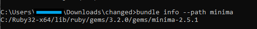

# Building and Customizing a minimal computing site
Building a minimal computing site involves creating a website with a focus on simplicity, efficiency, and accessibility. It minimize the resources required to host and access the site, which make it more sustainable and accessible in environments that are having limited internet connectivity or technological infrastructure.​

Jekyll is a free open-source static site generator that is built and runs on the Ruby programming language. It is a popular choice for building a minimal computing site due to its simplicity, flexibility, and efficiency.

## Steps to Build a minimal Computing site
1. Install Jekyll. 
2. Open Command Prompt CMD. 
3. Go to the directory where you want to save the site. For example, “C:\Users\user\Documents” 
4. Run the commands

    ```bash
    jekyll new <site_name>
    cd minima-site
    bundle exec jekyll serve
    ```
5. Browse to [http://localhost:4000](http://localhost:4000). 

## Steps to customize a minima Jekyll theme

To customize your theme, you need to understand the structure of your theme, so you can edit it.

### Understanding theme structure

*"When you create a new Jekyll site (by running the jekyll new <PATH> command), Jekyll installs a site that uses a gem-based theme called Minima.*

*With gem-based themes, some of the site’s directories (such as the assets, _data, _layouts, _includes, and _sass directories) are stored in the theme’s gem, hidden from your immediate view. Yet all of the necessary directories will be read and processed during Jekyll’s build process.*

*In the case of Minima, you see only the following files in your Jekyll site directory:"* [Jekyll Doc](https://jekyllrb.com/docs/themes/)

```bash
├── Gemfile 
├── Gemfile.lock 
├── _config.yml 
├── _posts 
│   └── 2016-12-04-welcome-to-jekyll.markdown 
├── about.markdown 
└── index.markdown
```

### Override theme defaults

*"Jekyll themes set default data, layouts, includes, and stylesheets. However, you can override any of the theme defaults with your own site content.*

*To replace layouts or includes in your theme, make a copy in your _layouts or _includes directory of the specific file you wish to modify, or create the file from scratch giving it the same name as the file you wish to override.*

*For example, if your selected theme has a page layout, you can override the theme’s layout by creating your own page layout in the _layouts directory (that is, _layouts/page.html).”* [Jekyll Doc](https://jekyllrb.com/docs/themes/)

  

1. **Locating a theme's files on your computer**
    1. Run the command below to locate the theme.
        ```bash
        bundle info --path <theme_name>
        ```

        

    2. Paste the provided path in the explorer to open it. Explorer window displays the theme’s files and directories. The Minima theme gem contains these files:
        ```bash
        ├── LICENSE.txt 
        ├── README.md 
        ├── _includes 
        │   ├── disqus_comments.html 
        │   ├── footer.html 
        │   ├── google-analytics.html 
        │   ├── head.html 
        │   ├── header.html 
        │   ├── icon-github.html 
        │   ├── icon-github.svg 
        │   ├── icon-twitter.html 
        │   └── icon-twitter.svg 
        ├── _layouts 
        │   ├── default.html 
        │   ├── home.html 
        │   ├── page.html 
        │   └── post.html 
        ├── _sass 
        │   ├── minima 
        │   │   ├── _base.scss 
        │   │   ├── _layout.scss 
        │   │   └── _syntax-highlighting.scss 
        │   └── minima.scss 
        └── assets 
            └── main.scss
        ```

2. **Selecting the file you want to override**
    From the theme's files, choose the file you want to override, create a similarly named file in your Jekyll Folder. Below we provide some examples:

    1. **Override minima home page Layout**

        Let’s say we want to override the minima’s home page layout. In your Jekyll folder, create a `_layouts` folder and add a file in it called `home.html`. Jekyll will now use your created `home.html` file instead of the default Minima theme `home.html` file. 

    2. **Override minima stylesheet**

        Let’s say we want to add some custom stylesheet changes.

        *"To modify any stylesheet, you must take the extra step of also copying the main sass file (`_sass/minima.scss` in the Minima theme) into the `_sass` directory in your site’s source."* [Jekyll Doc](https://jekyllrb.com/docs/themes/)

        In your Jekyll folder:  
        1. Create a `_sass` folder and add a file in it called `custom.scss`.
        2. In the `custom.scss` file add all your custom stylesheet changes and save it.
        3. Create an `assets` folder and add a file in it called `main.scss`.
        4. In the `main.scss` file add two lines, one is to load `_sass/minima.scss` file and the other is to import the `custom.scss` file.

        Example of `main.scss`
        ```scss
        --- 

        --- 
        /* load _sass/minima.scss */ 
        @import "minima"; 
        @import "custom" 
        ```

        Example of `custom.scss` stylesheet changes: 
        ```scss
        /* Put any custom CSS here */ 
        /*Links*/ 
        a {
        color: #2a7ae2; 
        text-decoration: none; 
        }

        /*Site header*/ 
        .site-header { 
        background: #5d6247; 
        } 

        /*Site footer*/ 
        .site-footer { 
        border-top: 1px solid #e8e8e8; 
        padding: 30px 0; 
        background: #5d6247; 
        } 

        /*Nav trigger*/ 
        .trigger a { 
        background: #e1e6cf; 
        padding: 3px 10px; 
        color: black; 
        } 

        /*Footer wrapper*/ 
        .footer-col-wrapper { 
        font-size: 15px; 
        color: #fffafa; 
        margin-left: -15px; 
        } 

        /*Site title*/ 
        .site-title, .site-title:visited { 
        color: #fffafa; 
        } 
        ```
