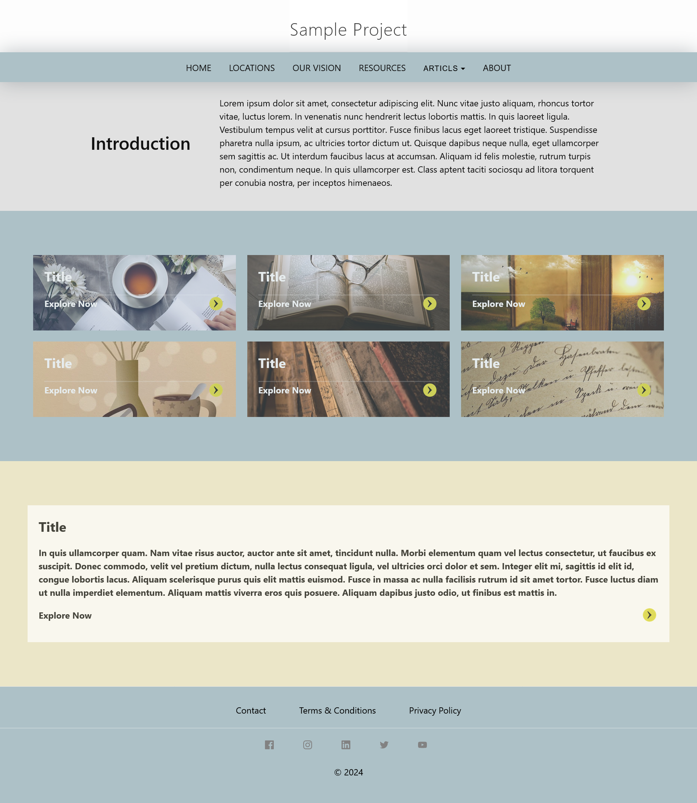

To customize the default landing page "index.markdown" in the Minima theme, follow these steps:

1. **In your Jekyll project, create a new folder named "_layouts".**
2. **In the "_layouts" Folder, create a new file named "home.html"**

    An Example of custom "home.html" layout page.

    ```ts
    
    ---
    layout: default
    ---
    <div class="home">
    {{ content }}
    </div>
    
    ```
3. **Locate the "index.markdown" file in your Jekyll project, and open it.**
4. **In your index.markdown file, update front matter to specify your page layout.**

    For Example:

    ```ts
    ---
    layout: home
    ---
    ```
3. **Add your landing page custom content.**

- Below we will provide you with an example of a landing page that contains a Banner section, an Images section, and a News section.

    **Example of index.markdown page:**

    ```ts
    ---
    # Feel free to add content and custom Front Matter to this file.
    # To modify the layout, see https://jekyllrb.com/docs/themes/#overriding-theme-defaults

    layout: home
    ---

    <div class="banner-title">
    <div class="left-text">
        <h1>Introduction</h1>
    </div>
    <div class="right-text">
        <p>Lorem ipsum dolor sit amet, consectetur adipiscing elit. Nunc vitae justo aliquam, rhoncus tortor vitae, luctus lorem. In venenatis nunc hendrerit lectus lobortis mattis. In quis laoreet ligula. Vestibulum tempus velit at cursus porttitor. Fusce finibus lacus eget laoreet tristique. Suspendisse pharetra nulla ipsum, ac ultricies tortor dictum ut. Quisque dapibus neque nulla, eget ullamcorper sem sagittis ac. Ut interdum faucibus lacus at accumsan. Aliquam id felis molestie, rutrum turpis non, condimentum neque. In quis ullamcorper est. Class aptent taciti sociosqu ad litora torquent per conubia nostra, per inceptos himenaeos.</p>
    </div>
    </div>

    <div class="images-section blue-background">
    <div class="image-container">
        <div class="images-list">
        <!-- Sample image link -->
        <a class="landing-image1" href="#">
            <div class="title">
            <h2>Title</h2>
            <div class="line"></div>
            </div>
            <div class="explore">
            <p>Explore Now</p>
            <p></p>
            </div>
        </a>
        <a class="landing-image2" href="#">
            <div class="title">
            <h2>Title</h2>
            <div class="line"></div>
            </div>
            <div class="explore">
            <p>Explore Now</p>
            <p></p>
            </div>
        </a>
        <a class="landing-image3" href="#">
            <div class="title">
            <h2>Title</h2>
            <div class="line"></div>
            </div>
            <div class="explore">
            <p>Explore Now</p>
            <p></p>
            </div>
        </a>
        <a class="landing-image4" href="#">
            <div class="title">
            <h2>Title</h2>
            <div class="line"></div>
            </div>
            <div class="explore">
            <p>Explore Now</p>
            <p></p>
            </div>
        </a>
        <a class="landing-image5" href="#">
            <div class="title">
            <h2>Title</h2>
            <div class="line"></div>
            </div>
            <div class="explore">
            <p>Explore Now</p>
            <p></p>
            </div>
        </a>
        <a class="landing-image6" href="#">
            <div class="title">
            <h2>Title</h2>
            <div class="line"></div>
            </div>
            <div class="explore">
            <p>Explore Now</p>
            <p></p>
            </div>
        </a>
        <!-- Add more image links as needed -->
        </div>
    </div>
    </div>

    <div class="news-section yellow-background">
    <div class="image-container">
        <div class="images-list">
        <!-- Sample news link -->
        <a href="#" class="news-href">
            <div class="title">
            <h2>Title</h2>
            <div class="line"></div>
            </div>
            <div class="news-content">
            <p>In quis ullamcorper quam. Nam vitae risus auctor, auctor ante sit amet, tincidunt nulla. Morbi elementum quam vel lectus consectetur, ut faucibus ex suscipit. Donec commodo, velit vel pretium dictum, nulla lectus consequat ligula, vel ultricies orci dolor et sem. Integer elit mi, sagittis id elit id, congue lobortis lacus. Aliquam scelerisque purus quis elit mattis euismod. Fusce in massa ac nulla facilisis rutrum id sit amet tortor. Fusce luctus diam ut nulla imperdiet elementum. Aliquam mattis viverra eros quis posuere. Aliquam dapibus justo odio, ut finibus est mattis in.</p>
            </div>
            <div class="explore">
            <p>Explore Now</p>
            <p></p>
            </div>
        </a>
        </div>
    </div>
    </div>
    ```

- Below is the custom stylesheet for the index.markdown page to be added in the custom.scss file.

    **Example of Custom stylesheet for the index.md page**

    ```ts
    // custom landing page stylesheet

    //banner section
    .banner-title {
        display: flex;
        padding: 2% 13%;
        background: #e1e1e1;
        align-items: center;
        counter-reset: 10px;
    }

    .left-text {
        flex: 1;
    }

    .left-text h1 {
        font-weight: 600;
    }

    .right-text {
        flex: 3;
    }

    // images section
    .image-split-background {
        width: 50%;
        position: relative;
    }

    .image-split-background::before {
        content: "";
        width: 100%;
        height: 100%;
        background: url('./assets/img/indexairindia.webp') no-repeat center;
        background-size: cover;
        position: absolute;
        top: 0;
        right: 0;
        border-top-left-radius: 50% 100px;
        border-bottom-left-radius: 50% 100px;
        clip-path: polygon(0 0, 100% 0, 100% 100%, 0 100%);
    }

    .image-container {
        max-width: 1360px;
        margin: 0 auto;
        padding: 80px 0;
    }

    .images-list {
        display: flex;
        flex-wrap: wrap;
        justify-content: space-around;
        row-gap: 20px;
        align-content: space-between;
        padding: 0 50px;
    }

    .images-list a {
        width: 367px;
        height: 100%;
        background-size: cover;
        opacity: 0.7;
        background-position: center;
        display: flex;
        flex-direction: column;
        justify-content: space-between;
        padding: 20px;
        color: white;
        font-weight: bold;
    }

    .images-list a.landing-image1 {
        background-image: url(/assets/img/landing_image1.jpg);
    }

    .images-list a.landing-image2 {
        background-image: url(/assets/img/landing_image2.jpg);
    }

    .images-list a.landing-image3 {
        background-image: url(/assets/img/landing_image3.webp);
    }

    .images-list a.landing-image4 {
        background-image: url(/assets/img/landing_image4.webp);
    }

    .images-list a.landing-image5 {
        background-image: url(/assets/img/landing_image5.jpg);
    }

    .images-list a.landing-image6 {
        background-image: url(/assets/img/landing_image6.jpg);
    }

    .images-list h2 {
        font-weight: 900;

    }
    .images-list .explore {
        display: flex;
        justify-content: space-between;
        align-items: center;
    }

    .images-list img {
        width: 32px;
    }
    // news section
    .news-section .images-list a {
        width: 100%;
    }

    .news-section .images-list a.news-href {
        background: white;
        color: black;
    }
    ```
- Go back to your browser. Your landing page should now look like this: 

