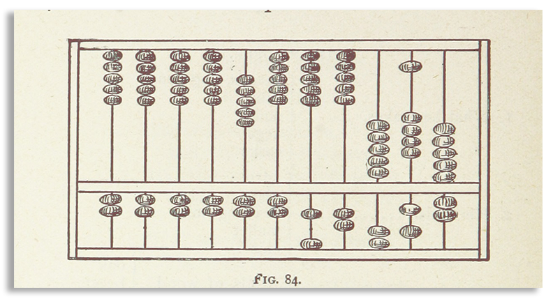

## Minimal Computing

 
_Image retrieved from [https://jntry.work/minimalcomputing/](https://jntry.work/minimalcomputing/)_

Minimal computing refers to a set of practices aimed at simplifying digital technologies and workflows to reduce computation resource consumption and dependency on complex software structures. As a benefit, minimal computing software emphasizes long-term maintenance and results in sustainable and durable software. Minimal computing is a design that implements the principles of reusable computer code and software. 

Throughout this learning module, you will explore the principles and practices of minimal computing, a methodology focused on simplicity, accessibility and sustainability in digital projects. We will demonstrate this design when building websites, using the publicly available tool Jekyll for building websites, and GitHub Pages to host these generate websites. Using GitHub as part of the technology stack directly supports reproducible software by being free, publicly-accessible and integrated with the GitHub cloud version control system.

1. **Introduction to Minimal Computing**: This section introduces the concept of minimal computing, discussing its advantages and disadvantages.
2. **Building a Minimal Computing Site**: Learn how to create a minimal computing site from scratch using Jekyll.
3. **Customizing a Minima Jekyll Theme**: Discover how to customize a minimal computing site that uses the Minima theme.
4. **Building a Minimal Computing Site with Idyll**: Learn how to create a minimal computing site from scratch using Idyll.
5. **Hosting a Minimal Computing Site on GitHub Pages**: Finally, explore how to host a minimal computing site on GitHub Pages.
