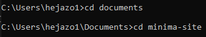
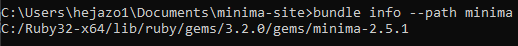
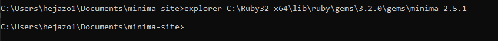

# Steps to customize a minima Jekyll theme

## A. Understand theme structure

Jekyll theme involves:
- Markdown files
- Layouts
- Includes
- Stylesheets
- Assets
- Data
- Configuration files

These contents are used to generate the HTML pages for the website.

## B. Override theme defaults

*"Jekyll themes set default **data**, **layouts**, **includes**, and **stylesheets**. However, you can override any of the theme defaults with your own site content.*

*To replace layouts or includes in your theme, make a copy in your `_layouts` or `_includes` directory of the specific file you wish to modify, or create the file from scratch giving it the same name as the file you wish to override.*

*For example, if your selected theme has a page layout, you can override the theme’s layout by creating your own page layout in the `_layouts` directory (that is, `_layouts/page.html`).”* [Jekyll Doc](https://jekyllrb.com/docs/themes/)

To Override theme defaults you need to locate the default themes files on your computer, then to select the specific file to override.

### 1. Locating theme's files on your computer

a. Open a command-line terminal.

b. Change directory into your Jekyll site.

For example:



b. Run the command below to locate the theme.
```bash
bundle info --path <theme_name> 
```
For example:



c. Invoke explorer with the provided path, substituting `/` with `\`.

For example:



Explorer window displays the theme’s files and directories. The Minima theme gem contains these files:
```bash
├── LICENSE.txt 
├── README.md 
├── _includes 
│   ├── disqus_comments.html 
│   ├── footer.html 
│   ├── google-analytics.html 
│   ├── head.html 
│   ├── header.html 
│   ├── icon-github.html 
│   ├── icon-github.svg 
│   ├── icon-twitter.html 
│   └── icon-twitter.svg 
├── _layouts 
│   ├── default.html 
│   ├── home.html 
│   ├── page.html 
│   └── post.html 
├── _sass 
│   ├── minima 
│   │   ├── _base.scss 
│   │   ├── _layout.scss 
│   │   └── _syntax-highlighting.scss 
│   └── minima.scss 
└── assets 
    └── main.scss
```

### 2. Selecting the file you want to override

From the theme's files, choose the file you want to override, create a similarly named file in your Jekyll Folder and add your customized contents there. Next sections we will provide you with some examples.
